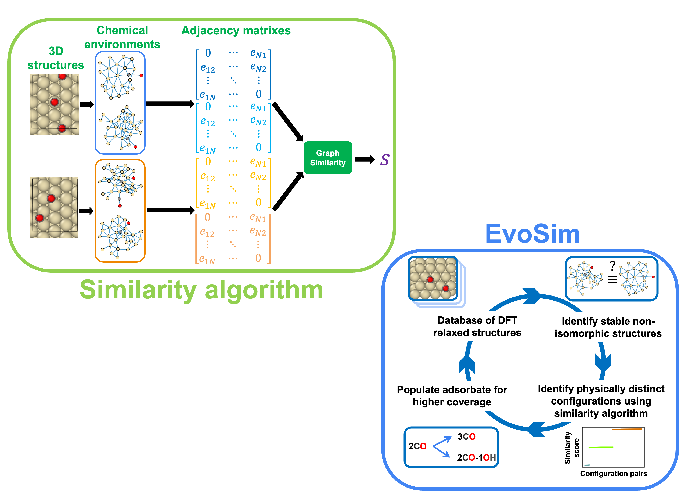

# Code for similarity calculations and $EvoSim$



Code for calculating pairwise structural similarity between
catalyst-adosrbate complexes.

An example similarity calculation can be found in `sim_calc.ipynb`.

An example of $EvoSim$ application can be found in `evosim.ipynb`,
involving the usage of `step1_get_init_conf.py` and `step2_postprocess_contcars.py`.

To properly use `similarity.py` code, users need to install the following packages.\
First, create a new conda environment called `sim`.
```bash
conda create -n sim python=3.9
```
* Surfgraph; https://surfgraph.readthedocs.io/en/latest/Installation.html
* PyTorch; https://pytorch.org
* Numpy version < 2.0
* scikit-learn; https://scikit-learn.org/stable/install.html
* Joblib; for parallel processing speed-up; https://joblib.readthedocs.io/en/stable/installing.html
* Pandas; for storing calculation results; https://pandas.pydata.org/docs/getting_started/install.html

Finally,
* the `similarity.py` needs to be added to the python path for similarity score calculations.
* the `utility.py` needs to be added to the python path for $EvoSim$.

### How to cite
If you find the similarity algorithm and $EvoSim$ is useful in your research,
please cite the following work. \
Jin Zeng, Jiatong Gui and Siddharth Deshpande., **A structural similarity based data-mining algorithm for modeling multi-reactant heterogeneous catalysts**., *Chemical Science*., DOI: 10.1039/D5SC02117K. [read paper](https://pubs.rsc.org/en/content/articlehtml/2025/sc/d5sc02117k)
```
@article{zeng2025structural,
  title={A Structural Similarity based Data-Mining Algorithm for Modeling Multi-Reactant Heterogeneous Catalysts},
  author={Zeng, Jin and Gui, Jiatong and Deshpande, Siddharth},
  journal={Chemical Science},
  year={2025},
  publisher={Royal Society of Chemistry},
  doi = {10.1039/D5SC02117K},
  url = {https://pubs.rsc.org/en/content/articlehtml/2025/sc/d5sc02117k}
}
```

### Video tutorials
Three videos are made that covevers:
* [Installation](https://www.youtube.com/watch?v=OvHoN5R5ic8&list=PLhdp8I9vDBKuK72udYfeh-ielXE00nexc&index=3)
* [Similarity Calculation](https://www.youtube.com/watch?v=YnqTpfUX51s&list=PLhdp8I9vDBKuK72udYfeh-ielXE00nexc&index=2)
* [*EvoSim*](https://www.youtube.com/watch?v=QZH-TUeKGTM&list=PLhdp8I9vDBKuK72udYfeh-ielXE00nexc&index=1)

Feel free to watch them!

### Note
This directory has the structure:
```bash
root_dir
├── Pt553_CO-OH/
    ├── CO.POSCAR # CO structure POSCAR
    ├── OH.horizontal.POSCAR # OH structure POSCAR
    ├── POSCAR_Pt553 # Empty Pt(553) surface POSCAR
    ├── 1CO-1CO-1OH-out/ # dir for 2CO-1OH coverage configurations
        ├── contcar/
            ├── *.POSCAR_all_sites/ # dir for DFT calculations
                ├── POSCAR
                ├── CONTCAR
                ├── energies.txt
        ├── unique_dir/
            ├── *.POSCAR_all_sites # initial configuration POSCAR
├── evosim.ipynb
├── sim_calc.ipynb
├── step1_get_init_conf.py
├── step2_postprocess_contcars.py
├── similarity.py
├── utility.py
├── 2COconf1.CONTCAR
├── 2COconf2.CONTCAR
├── 2COconf3.CONTCAR
├── 2COconf4.CONTCAR
├── ...
```

The `evosim.ipynb`, `step1_get_init_conf.py`, and `step2_postprocess_contcars.py` is
heavely rely on the above directory structure.
